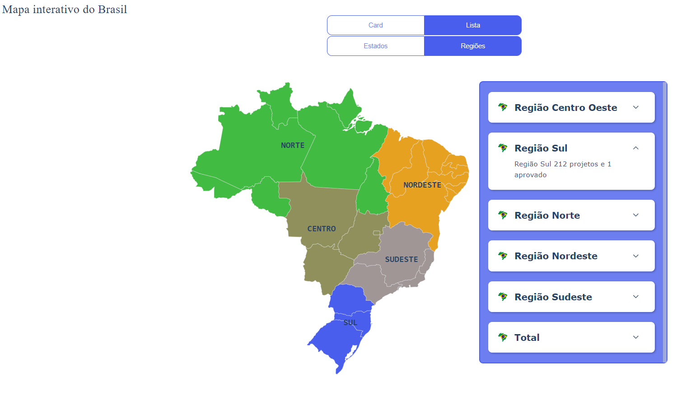
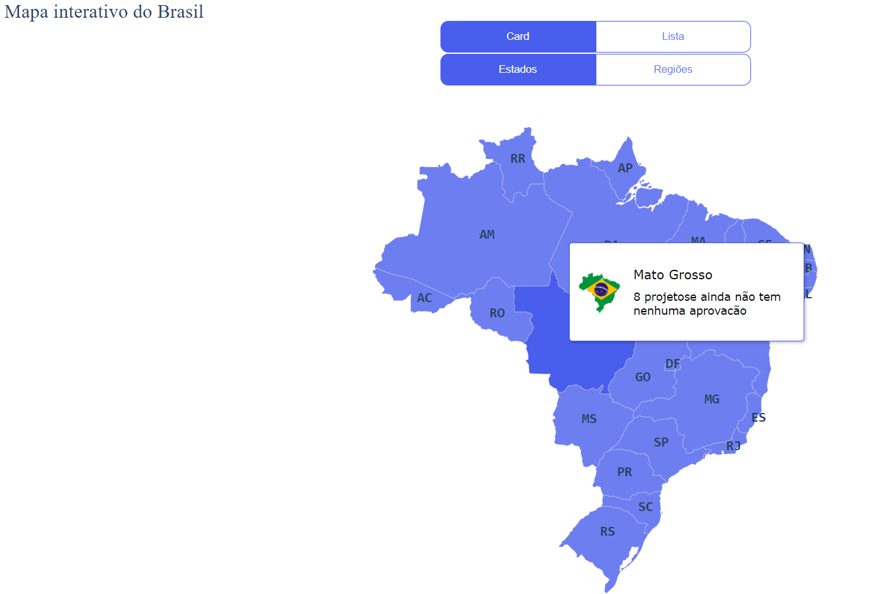
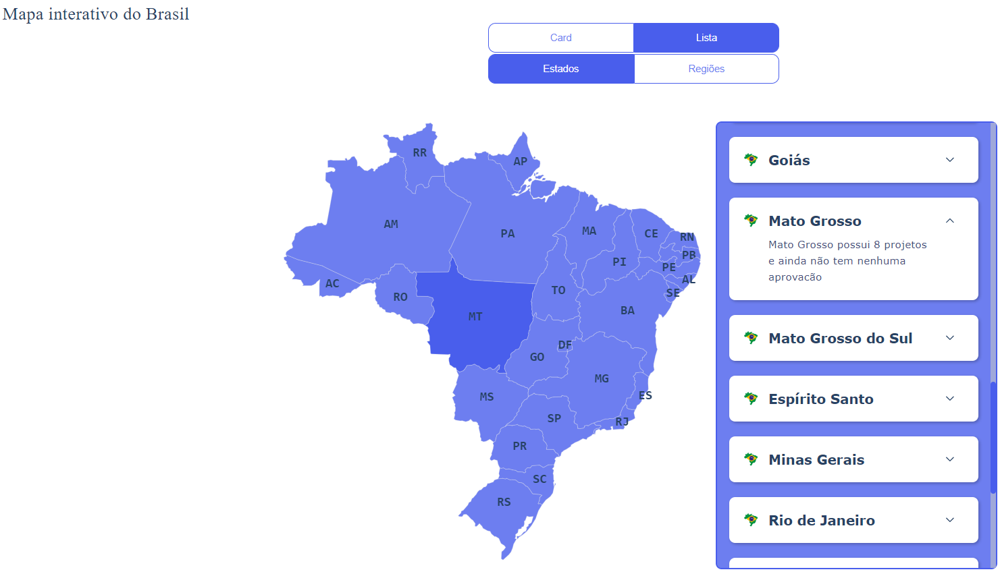
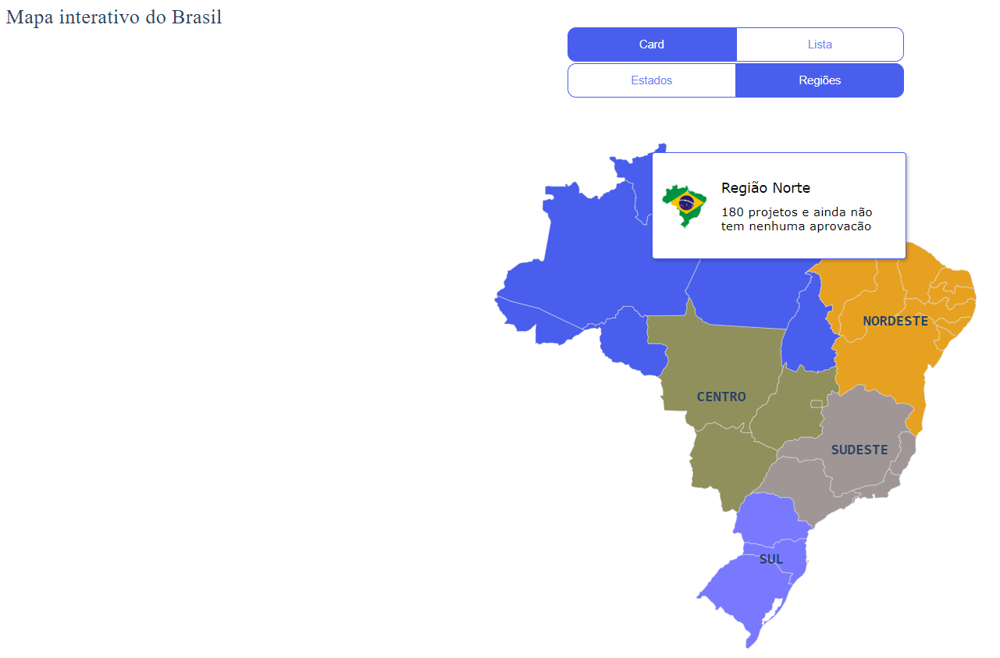

# Map Brazil Interactive

## To install
### `npm install`
## To run
### `npm run start`
Open [http://localhost:3000](http://localhost:3000) to view it in the browser.

David Sodré Lins
@davidsodrelins
www.davidsodre.com.br
2023